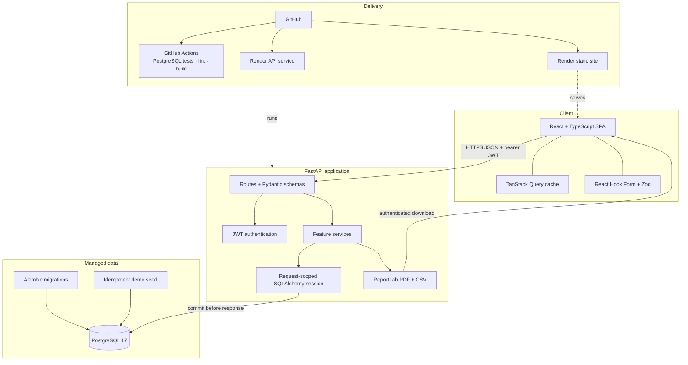
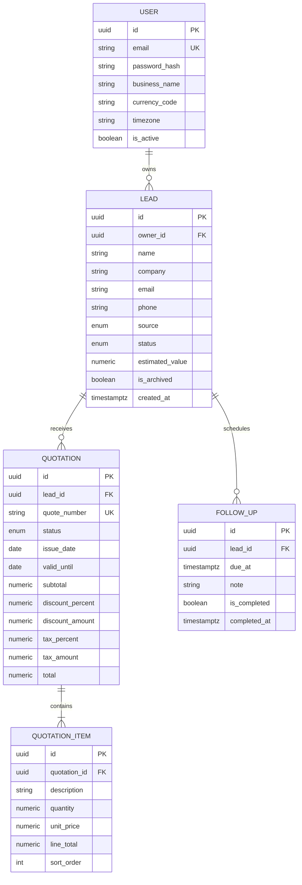
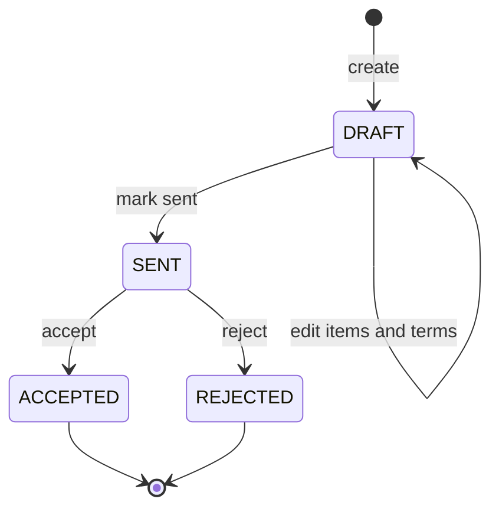

# ClientFlow architecture and data design

This document describes the deployed v1 boundary and the guarantees that matter when reviewing the code. ClientFlow is deliberately a modular monolith: one browser application, one API process, and one relational database keep the workflow understandable while preserving clear feature and service boundaries.

## System architecture



### Request boundary

1. The SPA calls the versioned `/api/v1` API through one authenticated fetch wrapper.
2. FastAPI validates the bearer token and input before a route invokes feature services.
3. Services query only records owned by the authenticated user and apply business transitions.
4. A single request-scoped SQLAlchemy session commits or rolls back before the HTTP response is returned.
5. TanStack Query invalidates related lead, quotation, follow-up, and dashboard keys after mutations.

This layout keeps HTTP parsing, validation, business behavior, and persistence separate without introducing distributed-service overhead.

## Entity-relationship model



Database constraints reinforce application rules: quote numbers are unique, monetary precision is fixed, item order is explicit, and a follow-up cannot be marked complete without a completion timestamp. Quotation items are lifecycle-owned by their quotation; lead-related business rows remain stored when a lead is archived.

## Ownership authorization

Authentication and ownership are separate checks:

- Argon2id verifies the password and a short-lived JWT identifies an active `User`.
- Every business route depends on that authenticated user. A route-inventory test compares this rule against generated OpenAPI paths.
- Lead queries include `Lead.owner_id == current_user.id`.
- Quotation and follow-up queries join through `Lead` and apply the same owner predicate.
- Missing, archived, and foreign-owned resources use the same structured `404`; the API does not reveal another tenant's record existence.
- Exports reuse the owned query path, so knowing a UUID cannot bypass authorization.

The frontend's protected routes are a usability boundary, not the security boundary. The API independently authorizes every request.

## Exact quotation calculations

Binary floating point is unsuitable for persisted prices because common decimal fractions cannot be represented exactly. ClientFlow therefore uses:

- Python `Decimal` for all server calculations.
- PostgreSQL `NUMERIC` columns for quantities, prices, rates, and totals.
- `ROUND_HALF_UP` at defined two-decimal money boundaries.
- Three decimal places for quantities and two for prices and percentages.

The server calculates in this order:

```text
line total = quantity × unit price
subtotal = sum(rounded line totals)
discount amount = subtotal × discount percent
taxable amount = subtotal − discount amount
tax amount = taxable amount × tax percent
total = taxable amount + tax amount
```

Request schemas do not accept line totals or aggregate totals. The builder's scaled-`BigInt` preview gives immediate feedback, but the returned server values replace it after save. The PDF and dashboard both read persisted authoritative totals.

## Quotation state machine



- Only `DRAFT` quotations can be edited.
- `ACCEPTED` and `REJECTED` are terminal.
- Marking a draft sent can advance an eligible lead to `QUOTED`.
- Accepting marks the parent lead `WON` in the same transaction.
- `SELECT … FOR UPDATE` serializes competing edit or transition requests; the losing request receives a normal `409 Conflict`.

The UI disables illegal actions, but the service layer remains authoritative and is tested directly through the API.

## Time and follow-up policy

Follow-up inputs require an explicit UTC offset and PostgreSQL stores timezone-aware instants. Group boundaries are calculated from the user's configured timezone: before the local day is overdue, the current local day is today, and future dates are upcoming. Completion is idempotent and retains its first `completed_at` value on retry.

## Deployment topology

```text
Render global static site
    └── HTTPS API call to Render Singapore web service
            └── IPv4 session-pooler connection to Supabase Tokyo PostgreSQL
```

The Render Blueprint contains no database password or demo secret. Provider-managed values are injected at deployment. API startup runs `alembic upgrade head`, performs the safe idempotent seed, and then starts Uvicorn. A database-backed health endpoint prevents a partially migrated service from being treated as healthy.

Production configuration fails closed when the signing key is weak or public, the development database URL is used, or CORS origins are empty/wildcard. The free Render service may cold-start, which is an operating constraint rather than an application failure.

## Verification layers

| Layer | Evidence |
| --- | --- |
| Schema | Alembic upgrade/downgrade round trip, constraint and drift tests |
| Services/API | PostgreSQL-only Pytest suite with rolled-back test transactions |
| Security | Route inventory, cross-tenant matrix, archive consistency, input safety |
| Concurrency | Row-lock and conflicting-transition tests |
| Browser | Playwright MVP, accessibility, downloads, and responsive layouts |
| Delivery | GitHub Actions with PostgreSQL 17 and production build |
| Production | Public health, CORS, login, route, PDF/CSV, and complete smoke tests |

